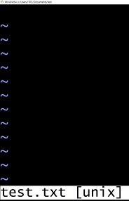

***01-4 빔 편집기.md***
# 빔 편집기에서 텍스트 문서 만들기👓
- 터미널에서 사용할 수 있는 편집기 중에 대표적인 것이 리눅스의 기본 편집기인 빔(Vim)입니다.

**빔이란**
- 깃의 기능을 배우고 익히는 데 집중하기 위해 복잡하고 긴 소스 코드 대신에 간단한 텍스트가 담긴 파일로 실습할 것입니다. 자주 사용하는 텍스트 편집기가 바로 빔입니다.

**빔에서 문서 작성하고 저장하기**
1. Documents 디렉터리로 이동한후 test 디렉터리를 만들고 test 디렉터리로 이동합니다.
```bash
$ cd Documents
$ mkdir test
$ cd test
```
2. test.txt파일을 만든다. 같은 파일이 없다면 그 이름으로 만들고 같은 파일이 있다면 그 파일을 엽니다.
```bash
$ vim test.txt
```
- 마크 다운에서 이미지 넣기
```

```


